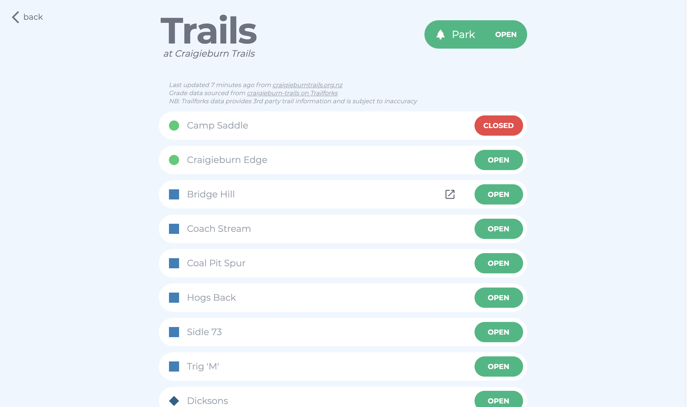

# Trailscrape

## About

### Why

Trailscrape is a project I developed in order to improve my full-stack development skills, using technologies such as [react-router](https://reactrouter.com/).

### What

Trailscrape was created to compile together MTB trail status info from all the many seperate riding area webpages in NZ. Combined with the crowd-sourced trail status info on [Trailforks](https://trailforks.com), an algorithm is used to display whether the trail or riding area is closed or not.

### Where

The live website is at [trailstatus.herokuapp.com](https://trailstatus.herokuapp.com), running on a heroku webapp with the scraper running on a cron-like scheduler every 10 min.

### Technologies

|          |          |
| -------- | -------- |
| Database | MongoDB  |
| Backend  | Express  |
| Frontend | React    |
| Scraper  | Selenium |

## Contributing

### Adding parks

If you are interested in creating a park, feel free to create a PR over at [trailscrape-backend](https://github.com/ryan-mooore/trailscrape-backend). Just add another scraper in the same format as the existing `scraper.py` files.

### Frontend or backend changes

run `npm start` to start a development environment. The webapp will run on port `:3000` with the api at `:9000/api`.
